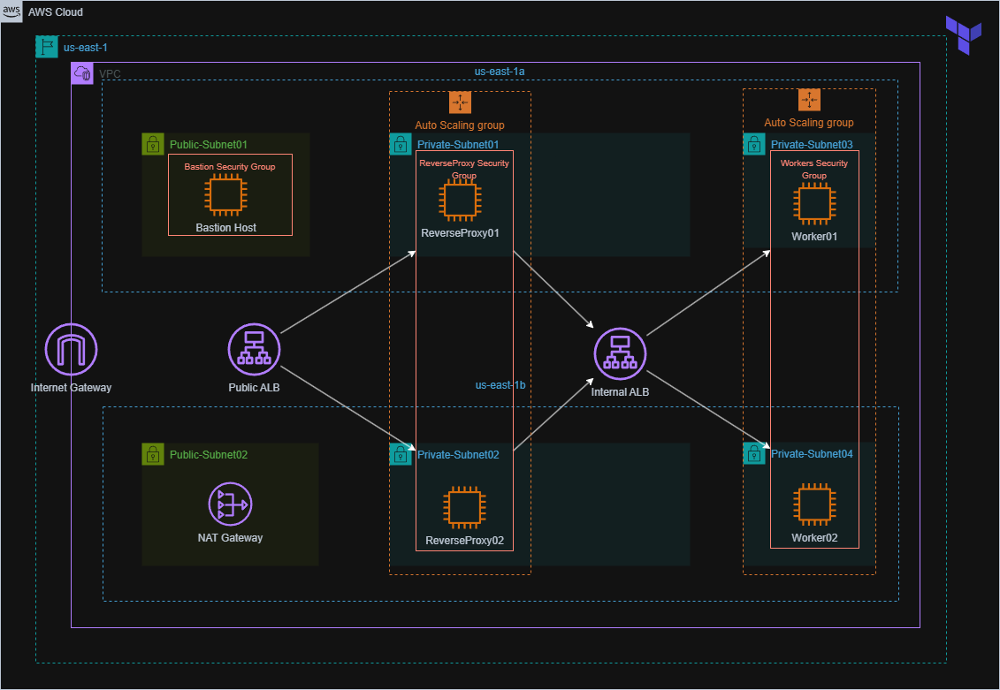

# MultiTier-Autoscaling-Application

---

## Table of Contents

1. [VPC](#vpc)
2. [Bastion Host](#bastion-host)
3. [Load Balancer](#load-balancer)
4. [Auto Scaling Groups](#auto-scaling-groups)
5. [Security and Accessibility](#security-and-accessibility)

---

## VPC

Our infrastructure resides within a dedicated VPC, providing isolated networking and enhanced control over subnets, route tables, and gateways. It consists of:

- **Public Subnets** for the bastion host and load balancer.
- **Private Subnets** for application instances (behind the Auto Scaling Group).
- **Route Tables** to control traffic between subnets and the internet.

---

## Bastion Host

A **Bastion Host** is deployed in a public subnet, allowing secure SSH access to the private EC2 instances in the infrastructure. Access is tightly controlled using:

- Security groups allowing SSH access only from known IPs.
- Private key-based authentication.
- No direct access to private instances from the internet.

---

## Load Balancer

A **Load Balancer** is placed in front of the Auto Scaling Group instances to:

- Distribute incoming traffic evenly.
- Perform health checks to route traffic only to healthy instances.
- Provide high availability and fault tolerance.

We use an **Application Load Balancer (ALB)** for HTTP/HTTPS traffic routing based on rules and host/path conditions.

---

## Auto Scaling Groups

**Auto Scaling Groups (ASG)** are used to manage a group of EC2 instances that automatically scale based on:

- CPU utilization.
- Network traffic.
- Custom metrics (if configured).

Benefits include:

- High availability.
- Cost-efficiency by scaling down during low demand.
- Fault tolerance with automatic replacement of unhealthy instances.

---

## Security and Accessibility

- **Security Groups** are defined per component to enforce least privilege access:
  - Load balancer: HTTP/HTTPS from the internet.
  - Bastion host: SSH from trusted IPs.
  - Private instances: Access only from the load balancer and bastion host.
- **NAT Gateway (optional)** can be added for instances in private subnets to access the internet without exposing them directly.

---

## Notes

- All resources are deployed using Infrastructure-as-Code (e.g., Terraform, CloudFormation).
- Monitoring and logging are enabled using CloudWatch.
- IAM roles and policies are applied to control access to AWS services.

---

